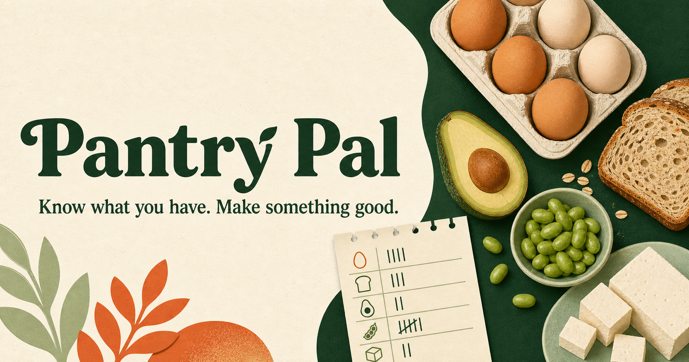

# Pantry Pal



Pantry Pal is a friendly, mobile-ready pantry tracker for answering a deceptively hard question: **what can I make with what I already have?**

The app keeps ingredients organized by storage location, tracks quantities, suggests quick meals, and automatically deducts the ingredients used when a recipe is cooked. All pantry data is saved locally on the device—no account or database required.

## Live site

[Open Pantry Pal](https://pantry-pal-kitchen.aryangosaliya.chatgpt.site)

The hosted site is currently private. A standalone offline HTML edition is also included with the project deliverables.

## Features

- Preloaded pantry inventory from a Costco receipt
- Fridge, freezer, and pantry location filters
- Fast ingredient search
- Add and adjust ingredient quantities
- Live AI-generated breakfast, lunch, and dinner ideas powered by OpenAI
- Built-in recipes that remain available if the AI service is unavailable
- Recipe readiness checks
- Automatic quantity deductions after cooking
- Device-local persistence with `localStorage`
- Responsive layouts for phones and laptops
- Accessible labels and reduced-motion support

## Included pantry items

Chicken Protein, Nurri Chocolate Protein, Organic Edamame, Spring Rolls, Suja Ginger, Organic Tofu, Guacamole Singles, Oat Nut Bread, Organic White Eggs, Strawberry Spread, Peanut Butter, and Organic Mixed Vegetables.

## Run locally

Requirements: Node.js 22.13 or newer.

```bash
git clone https://github.com/aryangosaliya3/pantry-pal.git
cd pantry-pal
npm install
npm run dev
```

Open the local address shown in the terminal.

To enable live AI recipes locally, copy `.env.example` to `.env.local` and add
your OpenAI API key. Never commit `.env.local` or paste the key into browser-side
code.

## Verify a production build

```bash
npm run build
```

## Project structure

```text
app/
  page.tsx       Pantry UI and interactions
  globals.css    Responsive visual system
  layout.tsx     Metadata and social sharing setup
public/
  og.png         Pantry Pal sharing card
.openai/
  hosting.json   Sites hosting configuration
```

## Technology

- React 19
- Next.js 16
- TypeScript
- Tailwind CSS 4
- vinext and Cloudflare Workers-compatible output
- OpenAI Sites hosting

## Data and privacy

Pantry inventory is stored in the browser under the `pantry-pal-v3` local-storage key. Nothing is sent to an external database. Clearing browser storage resets the saved inventory to the included Costco receipt items.

## AI recipe behavior

Pantry Pal uses the OpenAI Responses API with schema-validated output to create
three meal ideas from the in-stock pantry. Only ingredient names and quantities
are sent; the API key remains in the server environment. Generated recipe
amounts drive the existing **Cook & update pantry** flow.

## Roadmap

- Receipt and barcode scanning
- Optional account-based sync across devices
- Ingredient substitutions and dietary profiles
- Expiration reminders and shopping lists
- Custom recipes and serving-size adjustments

## Contributing

Issues and pull requests are welcome. Please run `npm run build` before opening a pull request.
